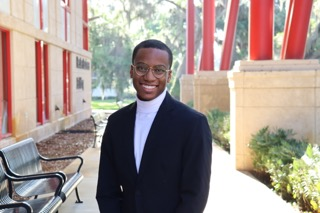

## PhD Student — Texts & Technology  
**University of Central Florida**

I research the intersections of **digital media preservation**, **ownership**, and **the politics of access** within software-driven cultural artifacts, particularly video games and interactive digital media systems.

---

### **Research Areas**
- Digital Content Preservation (esp. video games)
- DRM, Ownership & Licensing
- Platform & Online Service Shutdowns
- Generative Media Structures

---

### **Contact**
**Email:** JermaineJeromeJohnson@gmail.com  
**Location:** Davenport, FL  

### **Links**
- **Portfolio:** https://jermainejohnson.art  
- **GitHub:** https://github.com/JermaineFrame  
- **LinkedIn:** https://www.linkedin.com/in/jermainejohnsonart/